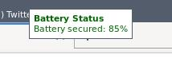

# battwarn.lua

This [Lua](https://www.lua.org) script is meant to be used in [awesome window manager](https://awesomewm.org). It is used to notify laptop users when battery is low or when battery is fully-charged. See pictures above for the results. 

## Usage

Just add `battwarn.lua` file contents to `$HOME/.config/awesome/rc.lua` and then (re)start your
awesomewm. That's all. See [example](example/) directory for more practical explanation.

