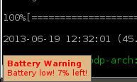

# battwarn.lua

This [Lua](https://www.lua.org) script is meant to be used in [awesome window manager](https://awesomewm.org). It is used to notify laptop users when battery is low or when battery is fully-charged. 

# Usage

Just copy `battwarn.lua` file to `$HOME/.config/awesome/` and require `battwarn.lua` in your `$HOME/.config/awesome/rc.lua` script:

```lua
...
...
require("battwarn")
...
...
```
Restart your awesomewm. That's all.


